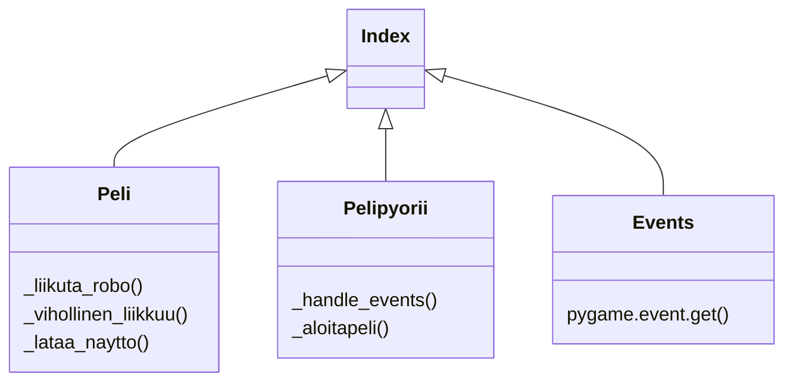

```mermaid
classDiagram
  Index<|--Peli
  Index<|--Pelipyorii
  Index<|--Events

  class Pelipyorii{
    _handle_events()
    _aloitapeli()

  }
  
  
  class Peli{
  
  _liikuta_robo()
  _vihollinen_liikkuu()
  _lataa_naytto()


  }

  class Events{
    pygame.event.get()

  }
 

```
