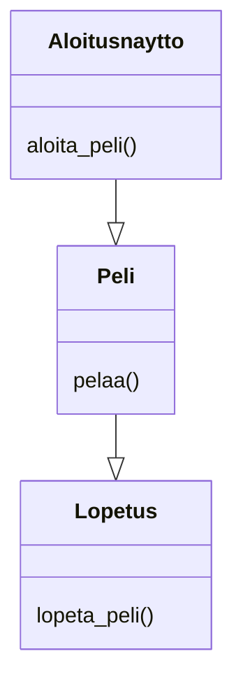
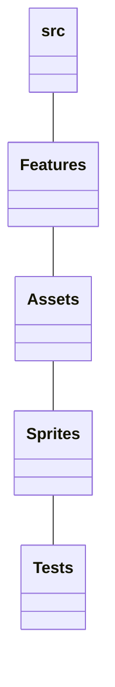
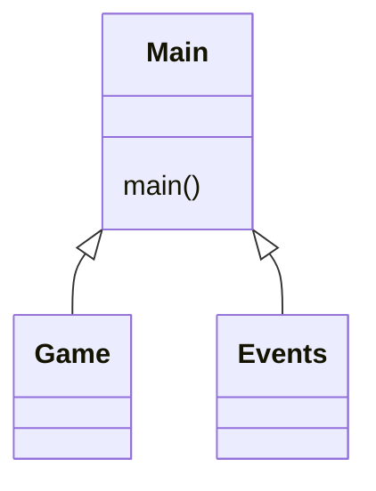
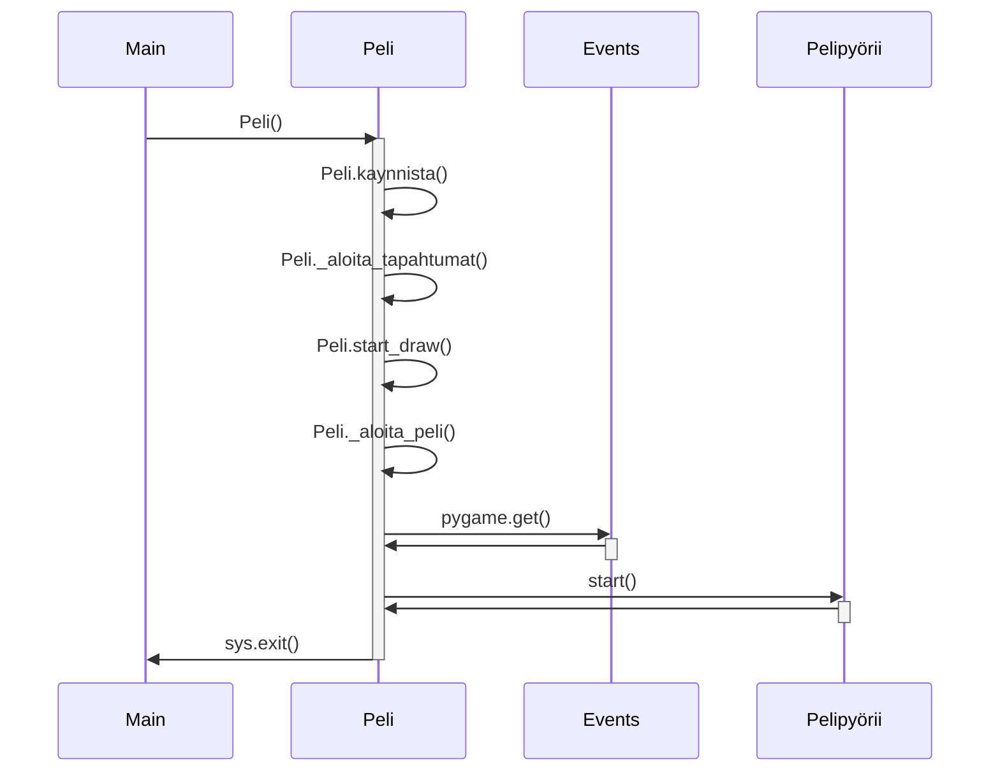
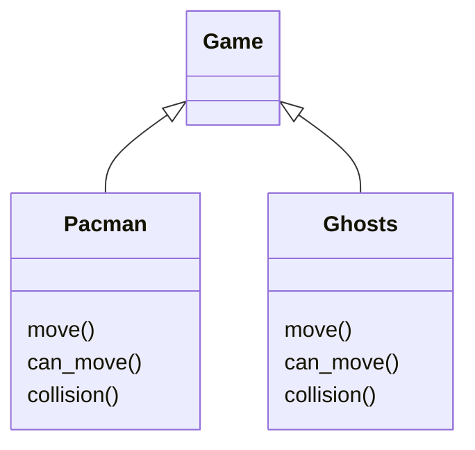

# Käyttöliittymä

Käyttöliittymä sisältää kolme erillistä näkymää:

- Aloitusnäyttö
- Pelaaminen
- Lopetusnäyttö

Jokainen näistä näkymistä on toteutettu omina luokkinaan. Näkymistä pääsee siirtymään erinlaisilla näppäimistö komennuksilla. Sovelluksen näkymä muokkaantuu pelin kulkiessa.

# Pelin rakenteita

# Rakennelogiikka

Rakennuslogiikan avulla ohjelman järjestelmällisyys pysyy järkevänä. Näin eri luokituksille suunnatut kansiot auttavat kuvastamaan niihin sisällettyjä tiedostoja.

# Päätoiminnallisuutta

# Pelin aloituksesta lopettamiseen

Aloitusnäytöstä päästään peliin painamalla näppäintä "a". Pelin hahmoja voi liikutella nuolinäppäimillä.

Pelin lopetuksen voi toteuttaa "SPACE" tämä toteuttaa ohjelmmalle exit komennon.

# Pelin eri hahmot ja niiden toiminnallisuus

