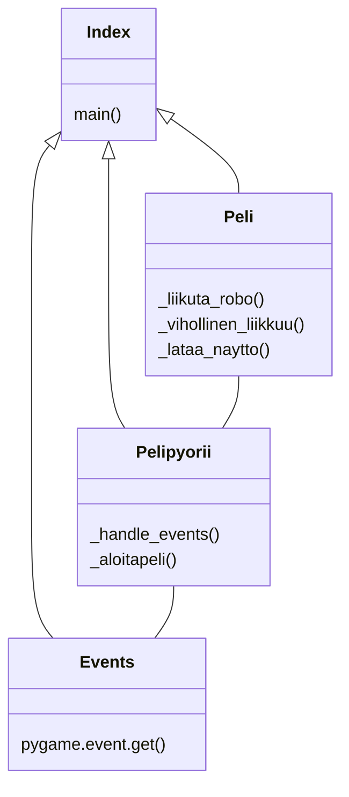
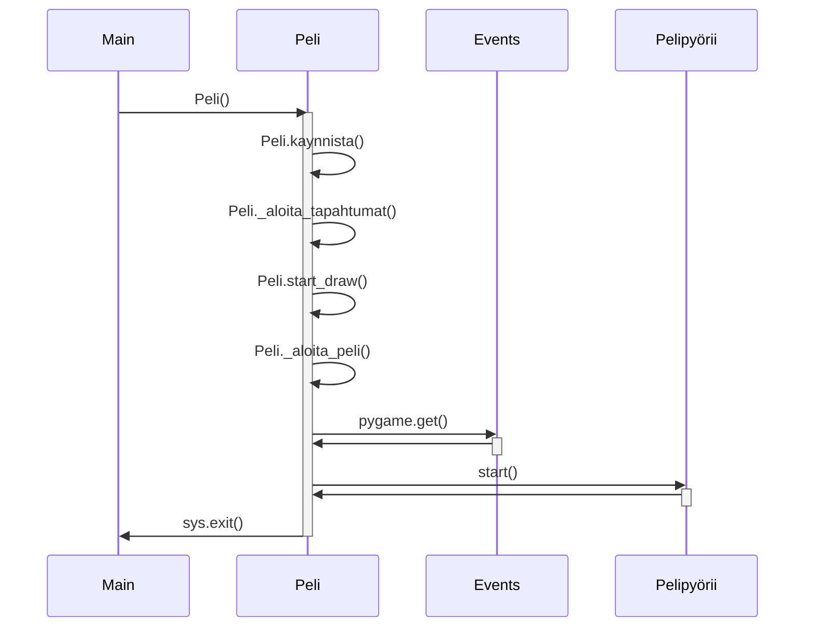

```mermaid
classDiagram
  Index<|--Peli
  Index<|--Pelipyorii
  Index<|--Events
  Peli--Pelipyorii
  Pelipyorii--Events
  
  class Index{
  main()

  }

  class Pelipyorii{
    _handle_events()
    _aloitapeli()

  }
  
  
  class Peli{
  
  _liikuta_robo()
  _vihollinen_liikkuu()
  _lataa_naytto()


  }

  class Events{
    pygame.event.get()

  }
 

```

**Kaavio kuvaa pelin käynnistymistä aloitus näytöstä pelin loppumiseen**

```mermaid

sequenceDiagram
participant Main
participant Peli
participant Events
participant Pelipyörii

Main->>Peli: Peli()
activate Peli
Peli->>Peli: Peli.kaynnista()
Peli->>Peli: Peli._aloita_tapahtumat()
Peli->>Peli: Peli.start_draw()
Peli->>Peli: Peli._aloita_peli()

Peli->>Events: pygame.get()
activate Events
Events->>Peli: 
deactivate Events

Peli->>Pelipyörii: start()
activate Pelipyörii
Pelipyörii->>Peli: 
deactivate Pelipyörii
Peli->>Main: sys.exit()
deactivate Peli
```
